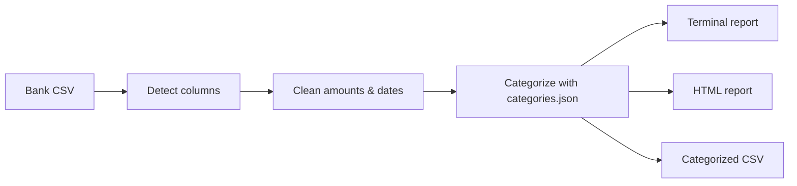

<div align="center">

# Hey, I'm Chris 👋

**Informatics & Digital Systems Student** · Linux · Security

[](https://github.com/jsvgd7g655-alt)

<br>


[](https://github.com/jsvgd7g655-alt?tab=followers)

</div>

---

## 👾 `whoami`

```
┌──(jsvgd7g655-alt㉿github)-[~]
└─$ cat about_me.txt
```

```
╔══════════════════════════════════════════════════════════════╗
║                                                              ║
║   Name    ──►  Chris                                         ║
║   Role    ──►  Computer Science Student 🎓                  ║
║   Studies ──►  Informatics - Digital Systems (Year 2)        ║
║   Focus   ──►  Systems, Security & Software Dev              ║
║   Based   ──►  Greece 🇬🇷                                     ║
║   OS      ──►  Ubuntu Linux / Kali Linux                     ║
║   VM      ──►  Oracle VirtualBox                             ║
║   Editor  ──►  VS Code + Vim (because both matter)           ║
║   Shell   ──►  Bash, always Bash                             ║
║   Quote   ──►  "In a world full of Windows, be Linux."       ║
║                                                              ║
╚══════════════════════════════════════════════════════════════╝
```

```
┌──(jsvgd7g655-alt㉿github)-[~]
└─$ echo "Currently: Learning something new every single day 🚀"
Currently: Learning something new every single day 🚀
```

---

## 🧬 About Me

- 🎓 **2nd-year student** of **Informatics – Digital Systems** — living the `segfault` life in C
- 💡 Passionate about **systems programming**, **Linux internals** & **cybersecurity**
- 🐧 Daily driving **Ubuntu Linux** — because life's too short for BSODs
- 🛡️ Exploring **Kali Linux** on **Oracle VirtualBox** for ethical hacking & CTFs
- 🔭 Currently learning: **Data Structures in C**, **OOP in C++**, **Bash scripting**
- 🧪 I break things in a VM so I don't break things in real life
- 💬 Ask me about **C pointers**, **Linux commands**, or **why Python is fun**
- 🎯 Goal: Master systems + security and contribute to open source
- ⚡ Fun fact: My code compiles on the **first try**... sometimes 😅

---

## 🚀 Currently Building — ZTM Build Fest 2026

**[Bank Statement Analyzer](https://github.com/zero-to-mastery/ZTM-Build-Fest/pull/4)** — a command-line tool that reads the CSV you export from your bank and shows where your money goes.

[](https://github.com/zero-to-mastery/ZTM-Build-Fest/pull/4)


- 📊 Spending by category, by month, biggest expenses and recurring payments
- 🇬🇷 Understands Greek and English bank exports (`;` or `,`, `1.234,56` or `1,234.56`, old Greek encodings)
- ➕ `add` command to record deposits and withdrawals from the terminal
- 🔒 Runs fully offline: your bank data never leaves your computer
- 🧪 Unit tests included



---

## 🗂️ Projects

| Project | What it is |
|---|---|
| [bank-statement-analyzer](https://github.com/zero-to-mastery/ZTM-Build-Fest/pull/4) | Offline CLI that analyzes bank CSV exports (ZTM Build Fest) |
| [bank-Atm-simulator-python](https://github.com/jsvgd7g655-alt/bank-Atm-simulator-python) | ATM simulator in Python |
| [HTML-Car-Game](https://github.com/jsvgd7g655-alt/HTML-Car-Game) | A simple game made in HTML for a college project |

### 🤝 Collaborations

| Project | My role |
|---|---|
| [wordsmith](https://github.com/CodebindPyth/wordsmith) by [@CodebindPyth](https://github.com/CodebindPyth) — synthetic data generator for custom passwords, emails and phone numbers, for testing and development | Helped with ideas, testing and documentation |

---

## 🛠️ Tech Arsenal & GitHub Activity

<div align="center">


</div>

<div align="center">


</div>

---

## 🐍 Watch the Snake Eat My Contributions


---

## 🧭 Learning Roadmap 2026

| | Topic |
|---|---|
| ✅ **Done** | Linux CLI & file system |
| 🔨 **Now** | C programming & pointers · Data structures in C · C++ & OOP · Python projects · Bash scripting |
| 🔜 **Next** | Networking & TCP/IP · Kali Linux & ethical hacking basics |
| 🎯 **Later** | CTF challenges · contributing to open source |

---

## 💻 Favorite Terminal Commands

```
# My daily drivers 🐧
$ sudo apt update && sudo apt upgrade -y     # Stay updated, always
$ grep -r "TODO" .                           # The endless list...
$ man everything                             # RTFM is a lifestyle
$ gcc -Wall -Wextra -o program program.c     # Compile with all warnings
$ gdb ./program                              # When printf isn't enough
$ nmap -sV 192.168.x.x                       # Kali things 👀
$ python3 -m http.server 8080                # Quick server, no setup
$ history | grep "that command I forgot"     # We've all been there
```

---

## 📬 Let's Connect

I love connecting with fellow developers and learners. Follow me here on GitHub, or open an issue on one of my repos and say hi. 😊


<div align="center">

⭐ If you like my profile, consider starring some of my repos! ⭐

💙 Made with passion, `gcc`, and way too much coffee


</div>
